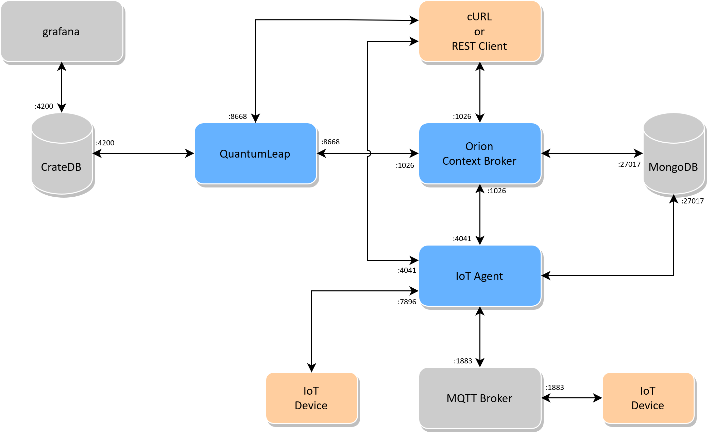

# FIWARE Platform Setup

Welcome to the quick setup of the FIWARE core on a Unix OS! 
With some minor changes to the docker files it might also work on a Windows OS but this is not tested so far! There are possibilities to run a sandbox with a Unix OS for Windows OS.

**Note:** We mostly link, sum up and also copy official documentation written and published by the FIWARE (Future Internet Software) foundation for that we do not claim ownership. Furthermore, we used the the recipes created as part of the SmartSDK project (https://www.smartsdk.eu/) which can be found on github:
https://github.com/smartsdk/smartsdk-recipes

## Introduction

This repository contains example docker yml files for the easy deployment of core elements aka *Generic Enablers* of the FIWARE plattform on a single computer setup via docker-compose and a multi node setup via docker swarm (also docker stack).
"FIWARE is a curated framework of open source platform components to
 accelerate the development of Smart Solutions." 
 Beside the fact that FIWARE is freely distributed, it comes along with the benefits of a large community and makes use of advanced components including high performance databases and a sophisticated set of Representational State Transfer (REST) application programming interfaces (API) using the standardized Next Generation Service Interface (NGSI) format. Latter is also the formal standard for context information management systems in smart cities.
 For more general information about FIWARE, why to use it and its core concept please check https://www.fiware.org/developers/  

At the moment, the FIWARE catalogue contains about 30 interoperable software modules, so-called Generic Enablers (GE) for developing and providing customized IoT platform solutions.
The core of the FIWARE platform used in the N5GEH project provides functionalities suited for most IoT-Applications. An overview of the platform components and their communication is depicted in the image below.
 

***Figure 1:*** *Overview of the FIWARE platform and its components*

The Orion context broker is the central component of our platform that provides update, query, registration and subscription functionalities via its API for managing the context information (entities and attributes) stored in the platform.
Orion is stateless and thus does not ofer any storage itself. 
It stores the data in an underlying [MongoDB](https://www.mongodb.com/) database.
MongoDB only stores the context information as well as the current values of the attributes.

In order to store time series data persistently, the GE QuantumLeap is deployed. 
Via the subscription mechanism, Orion can notify QuantumLeap whenever it receives updates on certain content. QuantumLeap then stores the data in the high-performance database [CrateDB](https://crate.io/).
Similar to Orion, QuantumLeap provides an API for querying and managing the historic data stored in the database.
Via the two APIs of Orion and QuantumLeap, data can be provided to any external service such as visualization, analysis or control algorithms.

Since most devices do not support the platform internal NGSI format, FIWARE offers a set of IoT Agents that translate IoT specific protocols and message formats, such as Ultralight 2.0, JSON, etc. into NGSI format.
For example, devices located in a building energy system can send and receive data either directly via HTTP or via an additional Message Queueing and Telemetry Transport (MQTT) Broker.
Particularly, in this work, we use the open source broker implementation of [Eclipse Mosquitto](https://mosquitto.org/). 
Mosquitto supports Transport Layer Security (TLS) and basic authentication and authorization features.
In this work, we used an adapted version of mosquitto in order to realize communication between the MQTT broker and a central Identity and Access Management (IDAM) using openID-connect and OAUth 2.0. 

To exploit the potentials of cloud technology, we deploy the platform via the virtualization technology docker. 
All images are open source and available on docker hub.
Using the virtualization technology docker, the setup is not bound to the host operating system since each container comes with its own running environment. Furthermore, the setup and configuration procedures are simplified by using pre-configured yml files. Last, docker swarm allows the distribution of platform components on multiple hardware nodes.

 For a closer look on FIWARE, please, find comprehensive tutorials here:
 https://fiware-tutorials.readthedocs.io/en/latest/index.html and the corresponding Git-Repositories: https://github.com/fiware/tutorials.Step-by-Step/ 
 These Git-Repos also provide a postman-collection that contain the basic CRUD queries for accessing the individual functionality. 

**Note:** We strongly encourage to work yourself through the tutorials since they provide sufficient knowledge for the proper use of platform components. For further informatoin, please, refer to:
https://github.com/Fiware/catalogue/releases

 

**Try it out! 
Thanks for any comments on it!**

## How to start

We recommend to start with a fresh Ubuntu Linux 20.04 instance. Used machines might work as well but there could be remnants that cause our setup to fail.

**Single computer setup:**

1. Install docker and docker-compose from https://www.docker.com. Usually, the docker community edition is sufficient for our purposes. 

      **Note:** In case you are not familiar with docker and docker-compose we highly recommend to start here: https://docs.docker.com/. The get-started tutorial explains the basic functionalities in a very good way. In case of issues with docker the page contains docker's full guidebook and documentation.

2. Clone this repository

        git clone https://github.com/N5GEH/n5geh.platform.git

3. You may adjust the docker-compose.yml or *.conf according to your preferences. Our provided file already provides a simple setup with all functionalities.

4. Start the platform using:

        docker-compose up -d

5. After a while, the platform should be up and running. You can check this by typing:

        docker ps

6. Enjoy testing and leave your comments.

**Multi node setup:**
(The according stack file is currently under review, we will update the file shortly.)

7. If not already done install docker as described in step 1.

8. If not already done clone this repository as described in step 2.
Start a swarm with at least one worker. You may add additional workers as well. At the moment, we do not show how to deploy the platform in high availability (HA). This will follow shortly.

9. Create a docker overlay network named **fiware_backend** and **fiware_service** which allows the attachment of additional containers following this tutorial from [docker](https://docs.docker.com/network/network-tutorial-overlay/).
This first network will be used for all FIWARE backend components.
The second one is meant for additional services you may want to add to your platform.

10. You may adjust the docker-stack.yml or *.conf according to your preferences. Our provided file already provides a simple setup with all functionalities.

11. Start the stack using:

        docker swarm init
        docker stack deploy -c <stack file> <stack name> 

    e.g    docker stack deploy -c docker-stack.yml fiware

12. After a while, the platform should be up and running. You can check this by typing:
    
        docker stack ls
        docker stack ps <stack name>  

## Security

This tutorial does not cover authentication for fiware services or Grafana. 
This setup should run behind a firewall and no ports on your host system should be exposed to the outside world before you apply security measures.
A suggestion of latter are shown in other tutorials, like [How to route and secure your applications](https://github.com/N5GEH/n5geh.tutorials.route_and_secure_applications)

## How to cite

We used this platform setup in the following publications:

T. Storek, J. Lohmöller, A. Kümpel, M. Baranski & D. Müller (2019). Application of the open-source cloud platform FIWARE for future building energy management systems. Journal of Physics: Conference Series, 1343, 12063. https://doi.org/10.1088/1742-6596/1343/1/012063

A. Kümpel, T. Storek, M. Barnski, M. Schumacher & D. Müller (2019) A cloud-based operation optimization of building energy systems using a hierarchical multi-agent control. Journal of Physics: Conference Series, 1343, 12053. https://doi.org/10.1088/1742-6596/1343/1/012053
