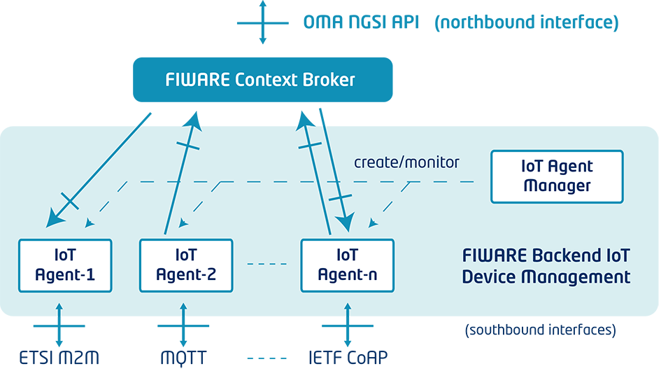
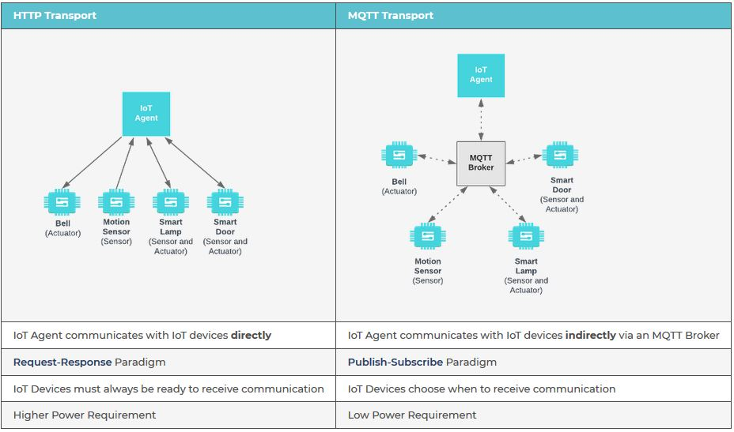
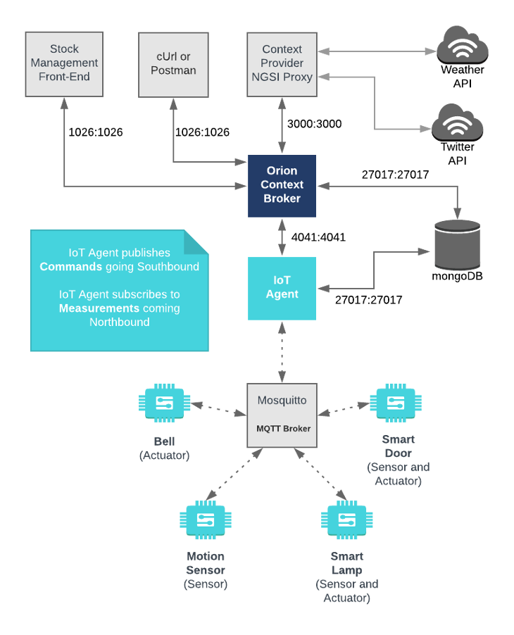

# IoT Agents

**Note:** Before setting up IoT Agents make sure that Orion and the mongoDB are up and running!

## Introduction and general information

For connecting IoT-devices, send their data and be managed from a FIWARE based
platform using thier native protocol FIWARE offers a selection of IoT Agents
based on a node.js library that you can find here
([Link](https://github.com/telefonicaid/iotagent-node-lib)). The corresponding
manual is available under
https://github.com/telefonicaid/iotagent-node-lib/blob/master/doc/usermanual.md

An overview of the concept is given in the figure below:

***Figure 1:*** *FIWARE IoT Device Management GE architecture (_source_: https://fiwaretourguide.readthedocs.io/en/latest/iot-agents/introduction/)*

Generally, the library offers developers the opportunity to build custom agents
for their devices and specific protocols that then can easily connect to NGSI
Context Brokers (such as Orion).

However, before starting implementing your own agents you should first check if
the already exiting agents may fit your needs. Here
([Link](https://www.fiware.org/developers/catalogue/)) you find a list of
exiting agents and their documentation.

On low level the agents can be configured via a config.js file. However, in this
tutorial we use docker as framework for our platform. Therefore, it is important
how the configuration via docker-compose and environment variables. An overview
of the commonly allowed variables is given here
([Link](https://iotagent-node-lib.readthedocs.io/en/latest/installationguide/index.htmlµ)).
If needed this list is extended by the individual agents because not all of them
need e.g. a configuration for MQTT.

MQTT(Message Queuing Telemetry Transport) is a widely used message protocol in IoT applications for realizing a machine-to-machine (M2M) communication. It has its origins in SCADA systems and therefore from the designed point a good starting point for most IoT purposes. Further instruction would go beyond of this tutorial.

Within the context of FIWARE MQTT changes the communication structure of devices according to the overview below:

***Figure 1:*** *Comparism between transport over HTTP and MQTT (_source_: https://fiware-tutorials.readthedocs.io/en/latest/iot-over-mqtt/index.html)*

Consequently, the overall architecture changes to the following:

***Figure 2:*** *FIWARE platform with connected MQTT-Broker (_source_: https://fiware-tutorials.readthedocs.io/en/latest/iot-over-mqtt/index.html)*

## How to start

Before you start you should think about some general questiions about the
configuration and services you need for your specific purposes.
1. What type of device do I want to connect to the platform?
2. What type of transportation protocol do I want to use? - e.g. HTTP, MQTT, AMQP etc.
3. How is the sent data formated? - e.g. JSON, Ultralight etc.

Depending on your needs you have to choose the right agent. In this repository
you will find a configuration for an IoT Agent for JSON and LWM2M, which should
be suffcient for most needs. Additionally, you will find quick start files for
an MQTT-Broker named Mosquitto. The choice of MQTT-Broker depends also on your
needs. However, Mosquitto is an realtively simple open-source implementation and
free to use. If you need something real fast with of sampling rates down to
milliseconds and high scalability you should think about using RabbitMQ and its
MQTT extension ([Link](https://www.rabbitmq.com/mqtt.html))

**WARNING:** Please be aware of the fact that we do not cover security aspects
here.

We also provide a whole in one example for a docker-stack.yaml-file:
    
    docker-stack-unsecured.yaml.EXAMPLE
     
1. Go into the iota subdirectory of your cloned version of the git and copy the docker-stack.yaml.EXAMPLE and possibly further configuration files

        cp docker-stack-unsecured.yaml.EXAMPLE docker-stack.yaml

2. Go into the mqtt-broker subdirectory of your cloned version of the git and copy mosquitto configuration file and rename it:

        cp mosquitto.conf.EXAMPLE mosquitto.conf

3. You may the docker-stack.yaml to you preferences e.g. you need to
adjust the placement of the container.

4. Start the service either using with this docker command:

        docker stack deploy -c docker-stack.yaml fiware

5. Check if all services are up and running

        docker stack ps [options] fiware
        
   You should find Orion, MongoDB and MongoExpress
         
6. Check if an Agent is properly working by making an HTTP request to the exposed port:

        curl -X GET \
        'http://<yourHostAddress>:4041/version'
        
    the response should look similar to the this:

        {
            "orion": {
                "version": "1.12.0-next",
                "uptime": "0 d, 0 h, 3 m, 21 s",
                "git_hash": "e2ff1a8d9515ade24cf8d4b90d27af7a616c7725",
                "compile_time": "Wed Apr 4 19:08:02 UTC 2018",
                "compiled_by": "root",
                "compiled_in": "2f4a69bdc191",
                "release_date": "Wed Apr 4 19:08:02 UTC 2018",
                "doc": "https://fiware-orion.readthedocs.org/en/master/"
            }
        }
    
## Troubleshooting

For troubleshooting the FIWARE community offers a quite good webinar on youtube
where they explain how to solve common mistakes and problems with iot agents.
https://www.youtube.com/watch?v=FRqJsywi9e8&feature=youtu.be

However, if you simply want to check for traffic you can use the integrated pm2 tool. 
For this you have to login into the container running the IoTA service:

      docker exec -it $(shell docker ps -f 'name=fiware_<yourAgentService>.1' -q) bash  
      
  and    
      
      pm2 monit
      
## Related Publications  

Preventis, A., Stravoskoufos, K., Sotiriadis, S. & Petrakis, E. G. M. (2016, April - 2016, April). IoT-A and FIWARE: Bridging the Barriers between the Cloud and IoT Systems Design and Implementation. In Proceedings of the 6th International Conference on Cloud Computing and Services Science (S. 146–153). SCITEPRESS - Science and and Technology Publications. https://doi.org/10.5220/0005912001460153
