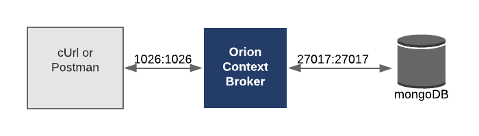

# Orion Context Broker (OCB), MongoDB and MongoExpress

## Introduction and general information

Together with the mongodb the context-broker also known as Orion is the main core of the fiware plattform. It handles all data wihtin the plattform and is required for all activities in and around fiware. To retrieve data from this database, users can query API of the context-broker.

"Orion is a C++ implementation of the [NGSIv2 REST API](https://swagger.lab.fiware.org/?url=https://raw.githubusercontent.com/Fiware/specifications/master/OpenAPI/ngsiv2/ngsiv2-openapi.json#/) (Swagger Documentation) binding developed as a part of the FIWARE platform.

Within the FIWARE platform, an entity represents the state of a physical or conceptual object which exists in the real world. For example, a Store is a real world bricks and mortar building. The context data of that entity defines the state of that real-world object at a given moment in time.
Orion Context-Broker allows you to manage the entire lifecycle of context information including updates, queries, registrations and subscriptions. It is an NGSIv2 server implementation to manage context information and its availability. Using the Orion Context Broker, you are able to create context elements and manage them through updates and queries. In addition, you can subscribe to context information so when some condition occurs (e.g. the context elements have changed) you receive a notification. These usage scenarios and the Orion Context Broker features are described in this documentation."

The detailed documentation and the user manual can be found [here](https://fiware-orion.readthedocs.io/en/latest/index.html). It provides all necessary information about the API and the whole functionality of the context-broker. Here especially the understanding of the ability for multi-tenancy is very important for large destributed IoT-Applications.

Furthermore, if you are interested in the code itself you'll find it on GitHub:
https://github.com/telefonicaid/fiware-orion

## Newest developments of the API:
Currently, the developers extent the orion API with NGSI-LD defined by the ETSO ISG CIM group. "This Cross-domain Context Information Management API allows to provide, consume and subscribe to context information in multiple scenarios and involving multiple stakeholders."

For quick overview about the API we recommend the check: https://app.swaggerhub.com/apis/jmcanterafonseca/NGSI-LD_Full/0.1.
Neverthelesse, the concept of linked-data should be fully understood beforehand because it is the main idea how to efficiently network multiple devices and add context information to them please check the additional information provided below. From our perspective within in the energy sector the concept of networking should follow the Smart Appliances REFerence (SAREF) ontology and its domoan specific extensions. The specification can be found [here](https://www.etsi.org/standards-search#page=1&search=SAREF&title=1&etsiNumber=1&content=1&version=0&onApproval=1&published=1&historical=1&startDate=1988-01-15&endDate=2018-12-06&harmonized=0&keyword=&TB=&stdType=&frequency=&mandate=&collection=&sort=3).

Within the FIWARE MongoDB is used for persisting context data across restarts. It is a requirement to Orion..
To retrieve data from this database, you should always use the query API of Orion instead of the direct database access.
This is recommended for both reasons: Security and data consistency.

"MongoDB is a document database with the scalability and flexibility that you want with the querying and indexing that you need"

- MongoDB stores data in flexible, JSON-like documents, meaning fields can vary from document to document and data structure can be changed over time

- The document model maps to the objects in your application code, making data easy to work with

- Ad hoc queries, indexing, and real time aggregation provide powerful ways to access and analyze your data (not recommended in our scenario)

- MongoDB is a distributed database at its core, so high availability, horizontal scaling, and geographic distribution are built in and easy to use

- MongoDB is free and open-source. Versions released prior to October 16, 2018 are published under the AGPL. All versions released after October 16, 2018, including patch fixes for prior versions, are published under the [Server Side Public License (SSPL) v1](https://www.mongodb.com/licensing/server-side-public-license).

For detailed information please visit https://www.mongodb.com.

**Note:** For our purposes the community edition should be sufficient.

Beside from mongo-db there are also many other DB-engines our there. The developers of fiware decided to choose this engine. For a comparative overview of diffenrent database engines, also the underlying of fiware click
 [here](https://db-engines.com/en/system/CrateDB%3BInfluxDB%3BMongoDB).

#### Additional background information:
- Find out more about ETSI - European Telecommunications Standards Institute: http://www.etsi.org/
- Find out more about Context Information Management: https://portal.etsi.org/tb.aspx?tbid=854&SubTB=854
- Find out more about specifications of NGSI-LD API - API defined by the ETSI ISG CIM [PDF](https://www.etsi.org/deliver/etsi_gs/CIM/001_099/004/01.01.01_60/gs_CIM004v010101p.pdf)
- Find out more about the concept of JSON-LD visit: https://json-ld.org/

## How to start:

1. Go into the ocb subdirectory of your cloned version of the git and copy the docker-stack.yaml.EXAMPLE and possibly further configuration files

        cp docker-stack.yaml.EXAMPLE docker-stack.yaml

2. You may the docker-stack.yaml to you preferences e.g. you need to
adjust the placement of the container.

3. Start the service either using with this docker command:

        docker stack deploy -c docker-stack.yaml fiware

4. Check if all services are up and running

        docker stack ps [options] fiware
        
   You should find Orion, MongoDB and MongoExpress
         
5. Check if Orion is properly working by making an HTTP request to the exposed port:

        curl -X GET \
        'http://<yourHostAddress>:4041/version'
    
    or 
    
        curl -X GET \
        'http://<yourHostAddress>:4061/version'
        
    the responses should look similar to the this:

        {"libVersion":"2.11.0","port":"4041","baseRoot":"/","version":"1.13.0"}

6. You can also check the MongoDB watching what is happening in the database 
via MongoExpress from your browser simply enter:
        
        http://<yourHostAddress>:8081
   
   Where your should see something similar to this but without the individual databases:
   
   
   
   
7. For connecting your first devices we recommend the Step-by-Step Tutorial:
    https://fiware-tutorials.readthedocs.io/en/latest/getting-started/index.html.
    However, for the building domain you might include the information provived above. 
    A small example will follow soon.
    
## How to setup in high available environment (HA):

This will follow soon ...
