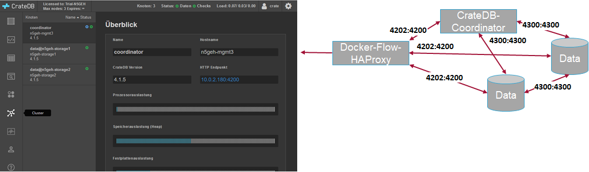

# QuantumLeap and CrateDB for handling timeseries data in FIWARE

**Note:** Before you start with the QuantumLeap make sure that the Orion, mongoDB 
and crateDB are up and running!

## Introduction and general information

QuantumLeap is a generic enabler which is used to persist context data into a 
high performance database as CrateDB. For the future it may also support 
e.g. InfluxDB. 
But it is still under incubation which is why we, for now, only recommend it together with CrateDB.

In this scenario we will use CrateDB for storing timeseries data that we connect to the context broker via QuantumLeap. To retrieve time-based aggregations of such data, users can either use QuantumLeap query API or connect directly to the CrateDB HTTP endpoint. The data then can be visualized in Grafana for instance. Nevertheless, in production mode it is highly recommended to not expose the http endpoint of the crateDB to the outside and only use the timeseries query functionality of QuantumLeap. This ensures the full use of fiware's identity management and ability for multi-tenancy. This why for the port of the webUI (4200) is commented in the compose-file. Internally, within the docker-network it is still available to other services.

"CrateDB is a distributed SQL database built on top of a NoSQL foundation. It combines the familiarity of SQL with the scalability and data flexibility of NoSQL, enabling developers to:

- Use SQL to process any type of data, structured or unstructured
- Perform SQL queries at realtime speed, even JOINs and aggregates
- Scale simply"

For detailed information please visit https://crate.io.

**Note:** For our purposes the community edition should be sufficient. If you
need more functionalities, please check [Link](https://crate.io/docs/crate/reference/en/latest/enterprise/index.html). For research purposes you may request an enterprise edition for free.

Beside from CrateDB there are also many other DB-engines out there. The developers of fiware timeseries API "QuantumLeap" started testing InfluxDB, RethinkDB and Crate. However, they have decided for now to focus the development on the translator for CrateDB because of the its advantages mentioned above. In future there might be also other DB-engines supported. For
comparative overview of diffenrent engines, also the underlying of fiware click
 [here](https://db-engines.com/en/system/CrateDB%3BInfluxDB%3BMongoDB). Among other detailed comparisons in their a series of white paper that you find [here](https://crate.io/cratedb-comparison/visit). CrateDB offers a comparism between CrateDB and InfluxDB made in 2017 click [here](http://go.cratedb.com/rs/832-QEZ-801/images/CrateDB-vs-Specialized-Time-Series-Databases.pdf?utm_medium=email&utm_source=mkto). For a performance evaluation of timeseries databases for monitoring purposes in general we recommend the master's thesis:
["Performance Evaluation of Low-Overhead Messaging Protocols and Time Series Databases
via a Common Middleware"](http://mitja.cc/master_thesis.pdf) by Mitja Schmakeit, 2017.

## How to start:

1. Navigate into the subdirectory "timeseries" of your cloned version of the git 
and copy the docker-stack.yaml.EXAMPLE and possibly further configuration files

        cp docker-stack.yaml.EXAMPLE docker-stack.yaml

2. You may the docker-stack.yaml to you preferences e.g. you need to
    adjust the placement of the container.
    In this example we use a local folder "data" for storing our data which we need 
    to create it first in our subdirectory.

        mkdir data

    Because of the mapped local volume of the
    docker container we always need to schedule the database container on the same host of our docker-swarm.
    You may solve this problem using a shared NFS volume or a Docker volume driver. This, however, is out of scope for this tutorial.

      **Note:** Our configuration uses the community edition as default. In case you own a license you may change it within your personal copy of the compose-file.

3. Start the service either using this docker command:

        docker stack deploy -c docker-stack.yaml fiware
        
4. Check if the services are up and running by making an HTTP request to the exposed port:

        curl -X GET \
        'http://<yourHostAddress>:/v2/version'

    the response should look similar to the this:

        {
          "quantumleap": {
            "version": "1.12.0-next",

          }
        }

5. If you published the port of the CrateDB as well you can check its admin GUI here:

        http://<yourHostAddress>:4200 

6. For handling your first timeseries data we recommend the Step-by-Step Tutorial:
https://fiware-tutorials.readthedocs.io/en/latest/time-series-data/index.html.

## How to setup in high availability environment (HA):

A detailed description of this will follow soon but you can already find an example for the docker-stack.yaml
in the repository.

**Figure 1** _CrateDB in HA environment using two data nodes, one arbiter and docker-flow as HA-Proxy configuration service_
